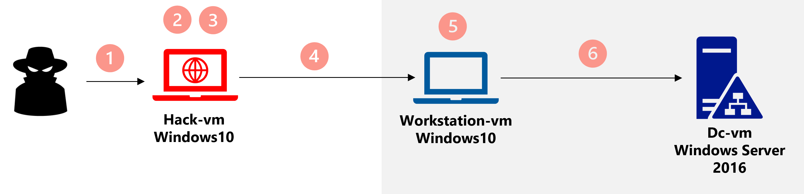

# Hacking-Game

## Goal

In this challenge, we invite you to step into the role of a hacker. Your first objective will be to access to a corporate network by infiltrating a user's machine. Once you have gained access to this machine, your ultimate goal will be to gain control over the company's domain.

Are you ready? 

## Environment 

There are 3 VMs: Hack-vm (Windows10), Workstation-vm (Windows10) and Dc-vm (Windows Server 2016) 

## Hacking Steps

1. Connect to the Hack-vm using RDP. Your coach will provide you with the Public IP address and credentials.

2. Use a tool from the toolbox to discover the private IP address of the Workstation-vm.

3. Use a tool from the toolbox to find the login and password that will allow you to connect to the Workstation-vm using RDP.

4. Connect to the Workstation-vm using RDP and the login and password found in step 3.

5. Discover the IP address of the domain controller Dc-vm.  

6. Use a tool from the toolbox, (a) to find the login and password hash of the Domain Admin then (b) to connect to the domain controller using RDP.

  >**Note**: Each tool should be used one time  

## Toolbox
1. Mimikatz
    - https://github.com/ParrotSec/mimikatz
    - https://techyrick.com/mimikatz-tutorial/
    - https://edermi.github.io/post/2018/native_rdp_pass_the_hash/

2. Nmap 
    - https://nmap.org/download.html

3. Hydra 
    - https://github.com/maaaaz/thc-hydra-windows
    - https://securitytutorials.co.uk/brute-forcing-passwords-with-thc-hydra/
    - https://github.com/adeldjama/Hacking-Game/blob/37fa336979bbdabf53f53ce07d7832900f47b2c4/resources/username.txt
    - https://github.com/adeldjama/Hacking-Game/blob/37fa336979bbdabf53f53ce07d7832900f47b2c4/resources/password.txt

